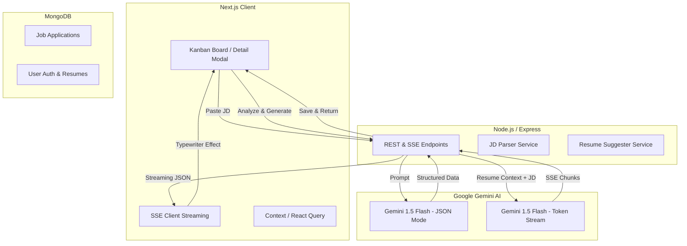

# 🚀 JobTracker: AI-Powered Job Application Tracker

JobTracker is a premium SaaS interface designed to streamline the job application process. By leveraging the **Gemini 1.5 Flash AI Engine**, it automatically extracts details from job descriptions and provides real-time, tailored resume optimization suggestions via streaming SSE (Server-Sent Events).

---

## 📊 System Architecture



---

## ✨ Key Features

- **🧠 Intelligent JD Parsing**: Paste any job description; the AI instantly extracts Company, Role, Skills (Required vs. Nice-to-Have), Location, and Seniority.
- **⚡ Real-time Resume Optimization**: Character-by-character AI streaming that generates tailored bullet points based on **your specific resume** and the job requirements.
- **📋 Premium Kanban Board**: A sleek, Linear-inspired board to track applications through every stage (Applied, Phone Screen, Interview, Offer, Rejected).
- **⏰ Overdue Alerts**: Subtle pulsing red indicators for applications requiring a follow-up.
- **📥 Data Portability**: Instant CSV export of your entire application board.
- **🧩 Modern UI/UX**: Glassmorphic design, smooth Framer Motion transitions, and advanced typewriter effects for AI responses.

---

## 🛠️ Tech Stack

- **Frontend**: Next.js 14, TypeScript, Tailwind CSS, Framer Motion, Lucide Icons.
- **Backend**: Node.js, Express, Mongoose, JWT Auth.
- **AI**: Gemini 1.5 Flash (Google Generative AI).
- **Database**: MongoDB (Atlas/Local).

---

## ⚙️ Development Setup

### 1. Prerequisites

- Node.js (v18+)
- MongoDB (Running locally or Atlas URI)
- Google AI (Gemini) API Key

### 2. Backend Setup

```bash
cd backend
npm install
# Create .env with:
# PORT=5000
# MONGO_URI=your_mongodb_uri
# JWT_SECRET=your_secret
# GEMINI_API_KEY=your_key
npm run dev
```

### 3. Frontend Setup

```bash
cd frontend
npm install
# Create .env with:
# NEXT_PUBLIC_BACKEND_URL=http://localhost:5000
npm run dev
```

---

## 🌑 Dark Mode & Design System

The app uses a curated high-contrast dark theme by default, featuring `backdrop-blur-xl` surfaces, `3xl` border radius, and premium typography. It supports toggleable themes via the `ThemeToggle` component.

---

## 📝 License

MIT License - Created for High-Performance Recruitment Tracking.
