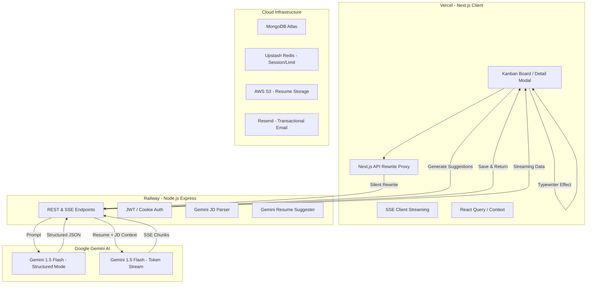

# 🚀 JobTracker: AI-Powered Job Application Tracker

JobTracker is a premium SaaS interface designed to streamline the job application process. By leveraging the **Gemini 1.5 Flash AI Engine**, it automatically extracts details from job descriptions and provides real-time, tailored resume optimization suggestions via streaming SSE (Server-Sent Events).

---

## 📊 System Architecture



---

## ✨ Key Features

- **🧠 Intelligent JD Parsing**: Paste any job description; the AI instantly extracts Company, Role, Skills (Required vs. Nice-to-Have), Location, and Seniority with validation against non-job text.
- **⚡ Real-time Resume Optimization**: Character-by-character AI streaming that generates tailored bullet points based on your uploaded resume and the specific job requirements.
- **📋 Premium Kanban Board**: A sleek, Linear-inspired board to track applications through every stage (Applied, Phone Screen, Interview, Offer, Rejected).
- **📱 Native Mobile Experience**: Custom horizontal scroll-snapping logic for Kanban columns, providing a native app feel on mobile devices.
- **🔒 Secure Authentication**: Robust JWT-based auth with cookie-based session management, featuring cross-domain sameSite policies.
- **📧 Automated Notifications**: Transactional emails for registration and account verification powered by Resend.
- **📥 Data Portability**: Instant CSV export of your entire application board.

---

## 🛠️ Technology Stack

### Frontend
- **Framework**: Next.js 16 (App Router)
- **State Management**: Tanstack Query (React Query) & React Context
- **Styling**: Tailwind CSS v4
- **Animations**: Framer Motion
- **Icons**: Lucide React

### Backend
- **Server**: Node.js & Express
- **Database**: MongoDB (Mongoose)
- **Caching/Rate Limiting**: Upstash Redis
- **Cloud Storage**: AWS S3
- **Email**: Resend API
- **AI**: Google Generative AI (Gemini 1.5 Flash)

---

## ⚙️ Environment Variables

### Backend (`/backend/.env`)
| Variable | Description |
|----------|-------------|
| `PORT` | Port number (default 5000) |
| `MONGO_URI` | MongoDB Connection String |
| `JWT_SECRET` | Secret key for JWT signing |
| `JWT_EXPIRE` | Token expiry (e.g., 1d) |
| `GEMINI_API_KEY` | Google AI Studio Key |
| `RESEND_API_KEY` | Resend.com API Key |
| `MAIL_FROM` | Verified sender email for Resend |
| `AWS_ACCESS_KEY_ID` | AWS Credentials for S3 |
| `AWS_SECRET_ACCESS_KEY` | AWS Credentials for S3 |
| `AWS_REGION` | S3 Bucket Region |
| `S3_BUCKET_NAME` | S3 Bucket Name |
| `FRONTEND_URL` | URL of the frontend (for CORS) |

### Frontend (`/frontend/.env`)
| Variable | Description |
|----------|-------------|
| `NEXT_PUBLIC_BACKEND_URL` | For local dev only (http://localhost:5000) |
| `BACKEND_URL` | Required for Vercel Rewrites (Railway link) |

---

## 🚀 Installation & Setup

### 1. Backend Setup
```bash
cd backend
npm install
# Configure .env
npm run dev
```

### 2. Frontend Setup
```bash
cd frontend
npm install
# Configure .env
npm run dev
```

---

## 🧠 Key Decisions & Optimization

### 1. Cross-Domain Cookie Proxying
Due to strict third-party cookie policies in modern browsers, we implemented **Next.js API Rewrites**. This allows the Vercel frontend to act as a proxy, making the browser believe the Railway backend is on the same domain, ensuring `httpOnly` cookies work seamlessly across domains.

### 2. Mobile Swipe-To-Scroll
Instead of stacking Kanban columns vertically (which breaks the drag-and-drop mental model), we implemented **CSS Scroll Snapping**. Columns lock to a fixed width on mobile, allowing users to "swipe" between stages with a native-app feel.

### 3. AI Validation & Security
Implemented double-layer validation. The Gemini AI prompt is engineered to detect non-job-related text (like recipes or lyrics). If detected, the backend rejects the entry before saving, preventing database pollution.

### 4. Direct Resend Integration
Switched from traditional SMTP (Nodemailer) to **Resend's Native SDK** to bypass common cloud-provider port blocks (like Port 25/587) and ensure 100% email deliverability for account verification.

---

## 📝 License
MIT License - Developed by Arth Arvind.
